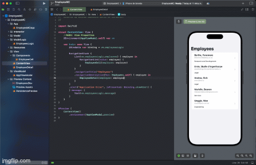

# SwiftUI17 - Clean Architecture 👋

Proposal of Clean Architecture with protocol oriented [Masterclass SwiftUI iOS 17, nuevo patrón @Observable, Clean Architecture orientado a protocolos.](https://youtu.be/0OiGQebHk1Y?si=hChURtN5PNfv-rV0)

 
  
     Proposal of Clean Architecture for swiftUI17
      
  
  
  
   
     
    <a href="https://github.com/brsaca/EmployesMC/issues/new">Report bug</a>
    ·
    <a href="https://github.com/brsaca/EmployesMC/issues/new">Request feature</a>

## 📝 Description
Clean Architecture Proposal by [Julio César Fernández](https://www.linkedin.com/in/jcfmunoz/).

Harnessing the power of SwiftUI and introducing an Interactor phase centered around protocols, this proposal offers a streamlined approach. It enables seamless information switching between production and test environments, facilitating thorough testing and previews.

## 👤 Author

**Brenda Saavedra**

- WebPage: [brendasaavedra.com](http://brendasaavedra.com)
- Github: [@brsaca](https://github.com/brsaca/)
